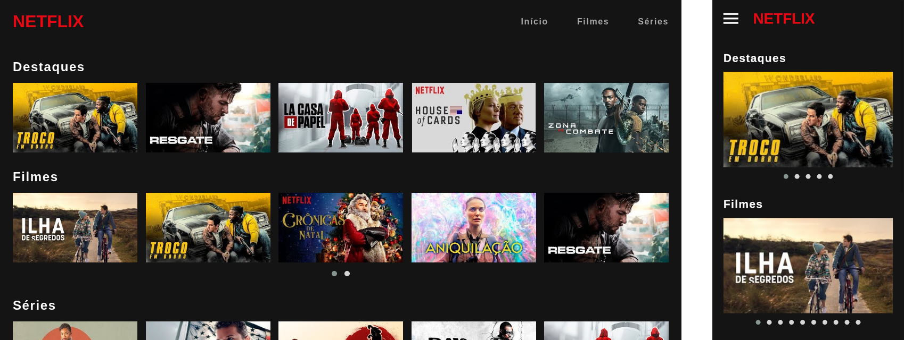

# Netflix Clone

Projeto prático visando aplicar os conhecimentos aquiridos em HTML5, CSS3 e JavaScript ES6.

## Descrição do projeto

A ideia era de recriar a interface do principal site de streaming mundial utilizando HTML5, CSS3 e JavaScript.

O projeto foi estruturado na metodologia mobile-first.

Foi utilizado o script [Owl Carousel 2](https://owlcarousel2.github.io/OwlCarousel2/) para rolagem das imagens dos filmes e séries.

Os dados dos filmes encontram-se no arquivo `main.js`, sendo providos pelo YouTube (imagens e vídeos). 

Como funcionalidade extra, ao clicar nas imagens será aberto um modal para execução do trailer, hospedado no YouTube.

## Como acessar

O código-fonte do projeto encontra-se totalmente nesse repositório do GitHub, onde também está hospedado e pode ser acessado em qualquer navegador no endereço [edenpaulocruz.github.io/netflix-clone/](https://edenpaulocruz.github.io/netflix-clone/).